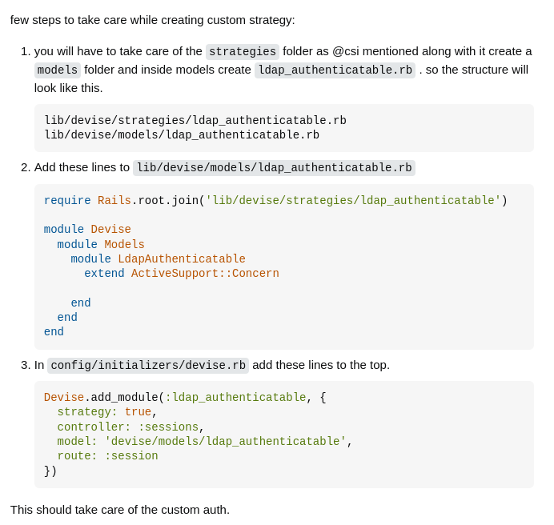
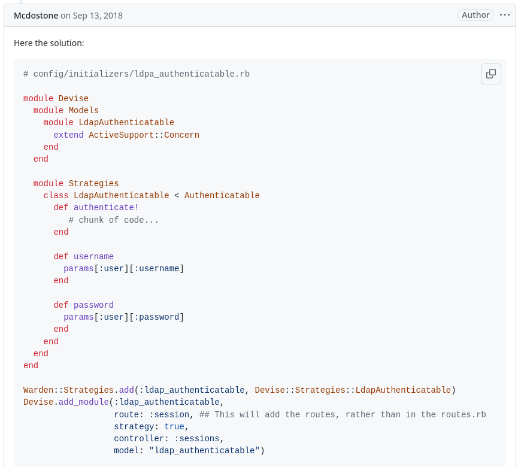
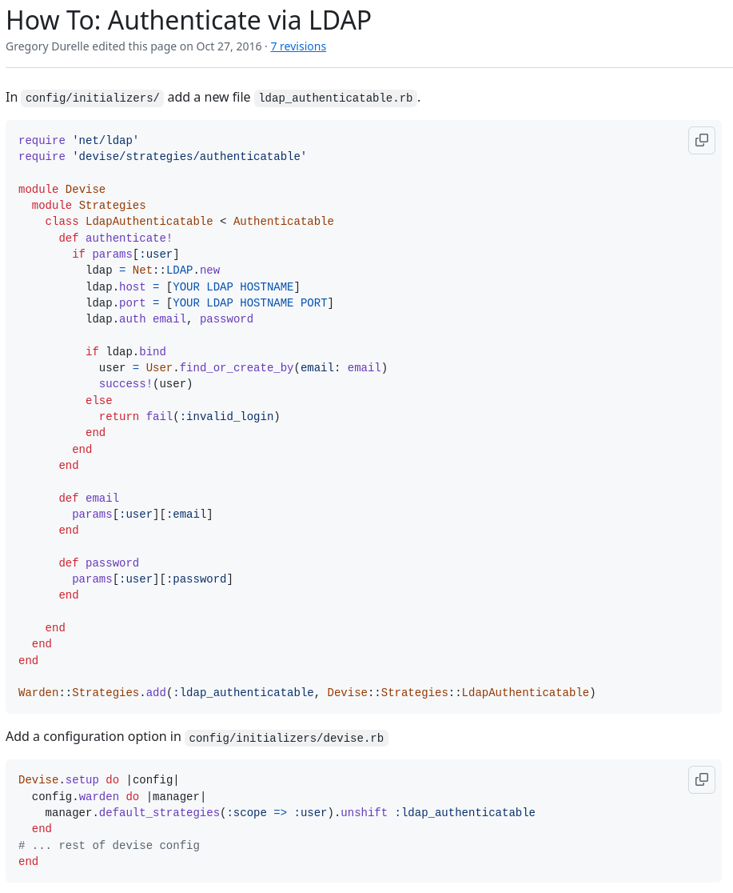

= Devise + LDAP
:author: Wolfgang Barth
:revdate: 2025-04-025

just collecting some references and ideas

== Stackoverflow

https://stackoverflow.com/questions/25374187/creating-a-custom-devise-strategy

== Github

https://github.com/heartcombo/devise/issues/4936

Older code from wiki, not working:

https://github.com/heartcombo/devise/wiki/How-To:-Authenticate-via-LDAP

== Extension of ldap_authenticatable

https://ognjen.io/devise-ldap-and-database/

== Some idea

----
include::ldap.rb[]
----